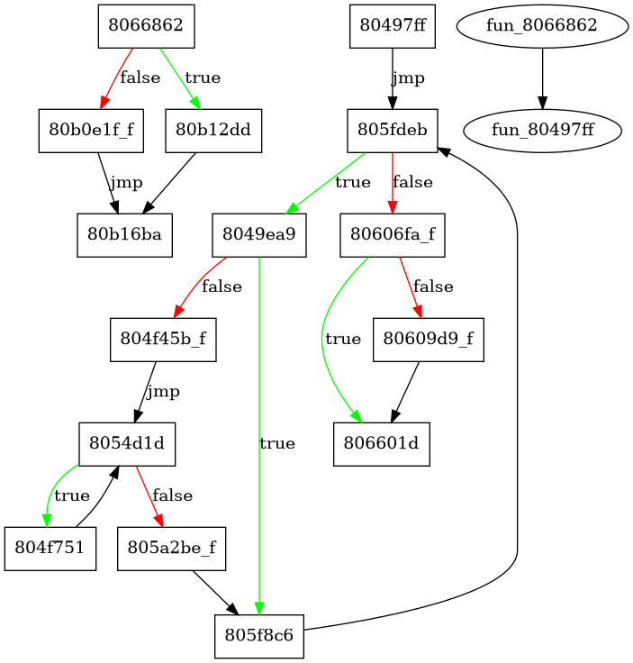

# One

## The Challenge
```
Did you know you only need ONE instruction to write any program?
What is the secret message that outputs "correct"? (printable ascii, wrapped in TFCCTF{})
```
Additionally a 6 MB ELF file was given as download:

`one: ELF 32-bit LSB executable, Intel 80386, version 1 (SYSV), dynamically linked, interpreter /lib/ld-linux.so.2, stripped`

## Analysis
Opening the file in Ghidra just resulted in a timeout of the decompiler.
Next I tried to make some sense of this with the control flow graph but it took ages to open and revealed only one big basic block.
So Ghidra is of no help here.

Next up was using `strace` and `ltrace` to understand what's going on.
```
# echo A | ltrace -i ./one
[0x80490b0] sigaction(SIGSEGV, { 0x8049060, <>, 0, 0 }, nil)                                                                                    = 0
[0x80490e7] sigaction(SIGILL, { 0x80490e7, <>, 0, 0 }, nil)                                                                                     = 0
[0x80b0291] --- SIGSEGV (Segmentation fault) ---
[0x80b0293] fgets("A\n", 100000, 0xf7e26700)                                                                                                    = 0x865c14c
[0x80b0552] --- SIGSEGV (Segmentation fault) ---
[0x80b0554] strtok("A\n", "\n")                                                                                                                 = "A"
[0x80b1cc6] --- SIGILL (Illegal instruction) ---
[0x80b1cc6] --- SIGILL (Illegal instruction) ---
[0x80b1cc6] --- SIGILL (Illegal instruction) ---
[0x80b1cc6] --- SIGILL (Illegal instruction) ---
[0x80b1cc6] --- SIGILL (Illegal instruction) ---
[0x80b1cc6] --- SIGILL (Illegal instruction) ---
[0x80b1435] --- SIGSEGV (Segmentation fault) ---
[0x80b1437] printf("sorry\n"sorry
)                                                                                                                   = 6
[0x80b1cc6] --- SIGILL (Illegal instruction) ---
[0x80495e8] --- SIGSEGV (Segmentation fault) ---
[(nil)] exit(1 <no return ...>
[0xffffffffffffffff] +++ exited (status 1) +++
```
The program reads the input with `fgets` checks for a newline with `strtok` and then prints the result with `printf`.
That's not very helpful but something else is going on.
In the beginning signal handlers for `SIGSEGV` and `SIGILL` are registered.
And during execution this signals are repeatedly raised.
My first thought was that this is some kind of anti debugging magic.
But still no clue on what's going on inside the program.

The next try was to use GDB to understand more of the program.
This didn't work immediately as GDB catches the signals but after disabling the signal handling it is possible to debug the program.
The following command line was useful to start GDB with the correct parameters: `gdb -ex "handle SIGSEGV pass nostop" -ex "handle SIGILL nostop" one`\
And then while stepping through the binary with GDB I finally noticed it.
The program uses only `mov` instructions!
Some time ago I saw a talk about a compiler for generating obfuscated X86 programs with only `mov` instructions.
Fittingly it is named [Movfuscator](https://github.com/xoreaxeaxeax/movfuscator).

## A Path
The next steps are clear.
Deobfuscate the binary, reverse the program and find a matching flag.
Shouldn't be that hard. Right?

As Movfuscator isn't particularly new and has been used in previous CTFs ( [here](https://ctftime.org/writeup/14537), [here](https://ctftime.org/writeup/12263) and [here](https://secgroup.github.io/2017/02/06/alexctf2017-writeup-packed-movement/) ) someone has surely written a deobfuscator.
And Searching the Internet quickly shows [Demovfuscator](https://github.com/kirschju/demovfuscator).
That should make it much easier.

Git clone, compile, run and ... segfault.\
Why can't a random tool from the internet just work?
After half an hour the bug was identified and some shitty C++ iterator code was fixed.
Running the demovfuscator it spits out a lot of warnings about hitting some limit but finishes execution without crashing.
As output it gives some symbols, a CFG and a patched binary.

The patched binary has some changes but opening it in Ghidra was about as helpful as before.
Executing it just results in a crash.
The [symbols](./symbols.idc) also seem more cryptic than helpful.
The only thing remaining is the CFG.

This finally gives some insight into the program but no details on how the input is processed.

## Blackbox
I wasn't ready to dive into the Movfuscator code jet and there was one more thing to try.
The `SIGILL` signal is used to jump from the end of the program back to the beginning.
The amount of loop iterations can be counted and is different for each input.
This reveals at least some information about the internal processing.
A similar technique was used to solve the first Movfuscator crackme in just 20 minutes.

I wrote a little [script](./blackbox.py) to try multiple inputs and count the number of raised `SIGILL`.
But the output looked just random and no clear pattern was visible.
The only interesting thing was that changes after the first four bytes made no difference.
So it was safe to assume that the input was only four bytes long.
Unfortunately the program was to slow for a brute force attack.

## Down the Rabbit Hole
Now there was nothing else left but to understand how Movfuscator works and write some kind of deobfuscator.

### Internals
The interesting stuff happens in the [movfuscator.c](https://github.com/xoreaxeaxeax/movfuscator/blob/master/movfuscator/movfuscator.c) from the git repository.
Here each of the IR instructions is converted into the x86 `mov` instructions.
The assembly from `emit_start()` matches exactly with the start of the binary.
This is already a good sign as no additional obfuscation is applied.
So I thought it should be possible to write matching rules for each of the emitting functions to recover the original instructions.

### Deobfuscator
Disassembling the binary with [Capstone](https://www.capstone-engine.org/) and writing a matcher for the mov instructions was straightforward.
Writing the matching rules was painfully slow and I started to realize that this is not going to work for all of the thousands of instructions.
I started with the interesting instructions, like compare, jump and call.
This should help to recover the control flow and from there it should be doable to identify the next used instruction.
[demov.py](./demov.py) is the script with all the rules that were finished before solving the challenge.

It turned out that the control flow instructions matched with the ones from Demovfuscator.
But now I know how the implementation works and can put a breakpoint at the point where both values for the comparison are loaded to register.
There were only a couple compares but changing the values at each of them made no difference.

### Control
Looking through the [slides](https://github.com/xoreaxeaxeax/movfuscator/blob/master/slides/domas_2015_the_movfuscator.pdf) again I found why the breakpoints weren't useful.
There is no real control flow and all instructions are executed continuously so it works a bit different.
A variable in memory is used to switch the execution on or off.
If it is on the code operates on the real data and if it is off the code only operates on fake data but the breakpoints trigger in both cases.

For toggling the execution the functions `execute_on()` and `execute_off()` are used.
With matching rules for these functions it is possible to locate the `on` variable in memory.
The location can the be used for conditional breakpoints.
This breaks at the last comparison but only if the execution is active: `b *0x080b0bd9 if *0x84747f8 == 1`

At this point the first value in `eax` is compare with the second value in `edx`.
The second value is always constant `0x1e61d640` and the first value is dependent on the input.
Changing the first value to the second one makes the program print out `correct!`.
I tried to figure out how the first value corresponds to the input but couldn't see and pattern.

### Recovering the logic
The next process was going through each basic block of the function and understanding what it does.
This was mostly just looking at the `mov` instructions and matching them against one of the Movfuscator functions.
One helpful thing were initialization sequences, where multiple registers and memory locations are set to zero.
For example, the following sequence of instructions is only found in the multiplication operation.
```
0x0805fe2f      c70510472708.  mov dword [0x8274710], 0
0x0805fe39      c70514472708.  mov dword [0x8274714], 0
0x0805fe43      c70518472708.  mov dword [0x8274718], 0
0x0805fe4d      c7051c472708.  mov dword [0x827471c], 0
0x0805fe57      c705a0462708.  mov dword [0x82746a0], 0
0x0805fe61      b800000000     mov eax, 0
0x0805fe66      bb00000000     mov ebx, 0
0x0805fe6b      b900000000     mov ecx, 0
0x0805fe70      ba00000000     mov edx, 0
```

After multiple hours of starring at the disassembly and matching instructions I identify these operations:
```
0x8049b5f-0x8049b88 : set counter to 2

0x805f8c6: bb start
0x805fb1e-0x805fbac: inc counter

0x0805fdeb: bb start
0x0805fe19-0x08060426: mul counter * counter
0x80604ab-0x8060548: compare counter, input

0x08049ea9-0x0804f1f0: udiv input / counter
replaces input with divided value if remainder is zero

0x08054d1d-0x805a064: udiv input / counter
replaces input with divided value if remainder is zero

0x08060a13-0x8065d5a: udiv
```
Debugging the program with GDB was immensely helpful to figure out where the input value ends up and how it is modified.
After recovering some of the operations and looking at the input and output values in GDB I finally reversed parts of the algorithm.

The input is interpreted as 32 bit integer.
This value is divided by a counter each iteration.
If it is divisible the result is divided again and again until it is no longer divisible.
The final result is saved back.
Finally the counter value is increased.
The exit condition seems to be `input < counter * counter.`
Now this looks like some basic algorithm for integer factorization.
This is not the full logic but maybe enough to figure out the rest without full reverse engineering.

### Cracking the Code
Knowing the input, output and parts of the logic should be enough to figure out the rest.
Another [script](./prime.py) was used to automate the process of providing the input and getting the output from the program.
Additionally the script prints the prime factor composition of the output.

Trying out different values some interesting things stood out.
Inputting a prime number always returns the number minus one: 13 -> 12, 11 -> 10\
Giving the square of a prime results in a value with the prime as a factor but also some other values: 13\*13 -> 156 with prime factors [2, 2, 3, 13]\
Then I finally had the right idea.
If inputting a prime gives the number minus one, maybe giving the product of two different primes, let's call them *p* and *q*, results in the product of both of them minus one (*p*-1)\*(*q*-1).
A quick test confirms this idea: 5\*7 -> 24 = 4\*6, 11\*13 -> 120 = 10\*12

The function looked familiar and a quick look at the cryptography lectures showed this must be Euler's *phi* function.
Some random inputs and outputs matched with the values from `sympy.totient` so this must be it.
Finally the code is cracked and the only thing left to do is calculate *n* for *phi*(*n*) = 0x1e61d640.

## Towards Insanity
Math Stackexchange to the rescue: [Inverse Euler totient function](https://math.stackexchange.com/questions/2261256/inverse-euler-totient-function)\
The answer shows that it's possible but doing it by hand for a large number isn't feasible.
Writing an implementation also seems like a lot of work and I was already very tired.
But now that the function is known maybe a brute force approach is possible again:
```python
chars = string.ascii_letters+string.digits+"!@#$%^&*()_\-+=:;<,>.?\/"
for a,b,c,d in itertools.product(chars, repeat=4):
    n = ord(a)+(ord(b)<<8)+(ord(c)<<16)+(ord(d)<<24)
    print(a, b)
    if sympy.totient(n) == 0x1e61d640:
        print(a,b,c,d)
        break
```
Unfortunately the script is slow.
But I used the meantime to search for an existing algorithm online.
The results weren't promising until I stumbled upon [this](http://www.numbertheory.org/php/carmichael.html) website.
I was about to close it again before I saw the tiny input fields at the bottom, let's hope this still works.
Putting in the searched number and setting the other tow fields to zero shows a page full of numbers.
The highlighted ones are solutions to the problem.

Filter out the other numbers and print the byte representation:
```python
for i in numbers:
    if sympy.totient(i) == 0x1e61d640:
        print(i.to_bytes(4, 'little'))
```
Looking for the first one without non ASCII characters I found `hAAI`.
A quick check:
```
# echo hAAI | ./one
correct!
```

But the flag wasn't accepts.\
Now I was sitting there at 3 AM in the morning, about to fall asleep and the laptop fans were running at full speed from the brute force script, and the correct solution wasn't accepted...

Ok, maybe there are multiple solutions.
One last script should do it.
Filter out all solutions with bad characters:
```python
for i in x:
    if sympy.totient(i) != 0x1e61d640:
        continue
    try:
        m = i.to_bytes(4, 'little').decode()
    except:
        continue
        pass
    bad = False
    for c in m:
        if c not in chars:
            bad = True
    if not bad:
        print(m)

```
Only four inputs remain: `R!&D`, `4nVj`, `hAAI`, `mov!`\
The correct one is pretty obvious.
And also accepted by the scoreboard!
FINALLY!!!
